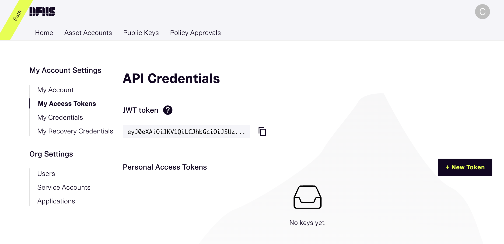
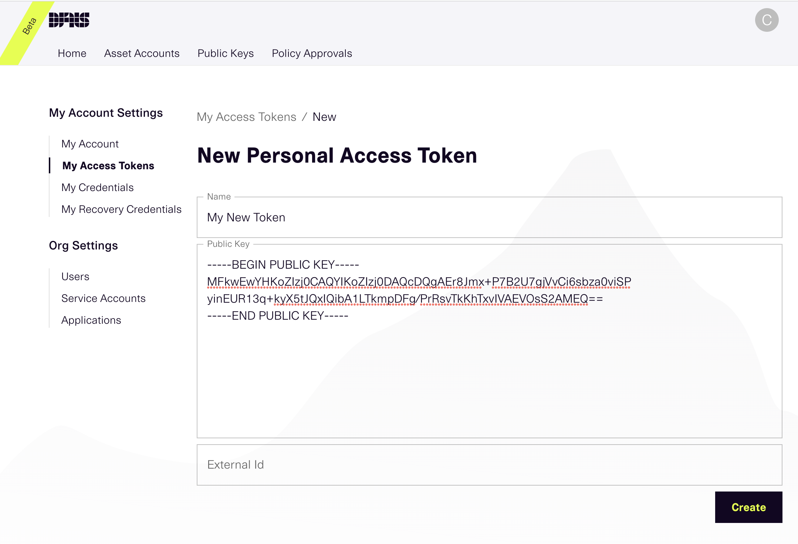
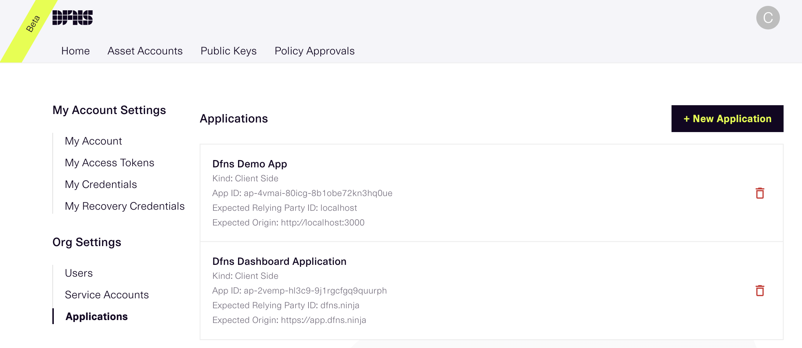
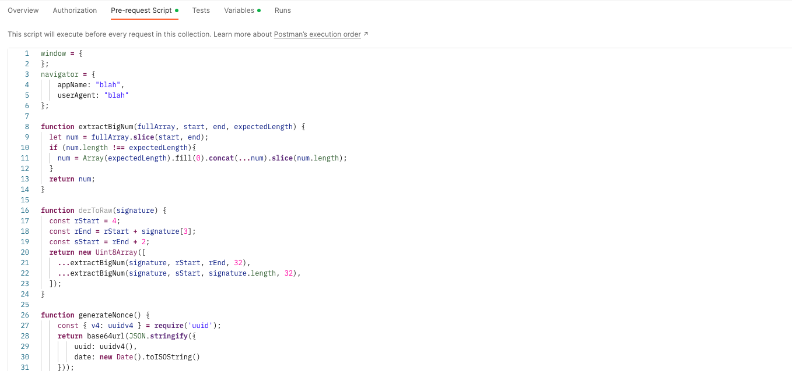
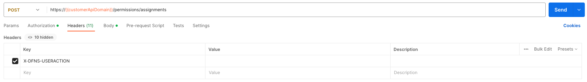

# 🆕 Beta: Authentication

## Postman Integration
To use Postman we recommend using a [Personal Access Token](./personal-access-token-management/) or a [Service Account](./service-account-management/).

### Setup
To make calls within postman you need to:


<details>

<summary>1. Create a public / private key pair</summary>

The public private key pair will be used to sign user actions within the Dfns API.

```shell
# Generate a ECDSA Private Key and the public key pair
openssl ecparam -genkey -name prime256v1 -noout -out prime256v1.pem
openssl pkey -in prime256v1.pem -pubout -out prime256v1.public.pem
```

</details>

<details>

<summary>2. Create a Personal Access Token or Service Account in the Dfns Dashboard</summary>

Personal access tokens can be created in the Dfns dashboard under the Settings page.

<figure><figcaption><p>Dfns Dashboard - Personal Access Token list</p></figcaption></figure>

When creating a new Personal Access Token, you will need to copy the public key (in `prime256v1.public.pem`) you create earlier into the Public Key.

<figure><figcaption><p>Dfns Dashboard - New Personal Access Token</p></figcaption></figure>

Be sure to copy the JWT, after the Personal Access Token is created, as you will need it in the next step.

</details>

<details>

<summary>3. Create and populate an environment in Postman</summary>

In the environment you need to set the following variables:

* `customerAccessToken` - The Personal Access Token JWT you copied ealier. This setting should be marked as Secret.
* `customerAccessTokenPrivateKey` - The private key created earlier. Copy the key including all newlines into the variable. This setting should be marked as Secret.
* `customerAppId` - The `App ID` of the Dfns application. This can be found in the Dfns dashboard under `Settings`->`Org Settings`->`Applications`.

<figure><figcaption><p>Dfns Dashboard - Application list</p></figcaption></figure>

* `customerAppOrigin` - The `Expected Origin` from your Dfns Application. Also found on the Applications page on the Dfns Dashboard.
* `useAuthV2` - Set to `true`.

</details>

<details>

<summary>4. Add Pre-request Script to all calls in Postman</summary>

In Postman, click on the folder that holds all the Dfns API calls. On the `Pre-request Scropt` tab paste the following script.

This script will run before each API call, and will handle setting headers and performing `User Action Signing`.

<figure><figcaption><p>Postman Pre-request Script</p></figcaption></figure>

```javascript
// jsrsasign expects us to be in a browser, but they don't really use the values for anything.
// So if we setup a fake window and navigator object, everything works fine from Postman.
window = {
};
navigator = {
    appName: "blah",
    userAgent: "blah"
};

function extractBigNum(fullArray, start, end, expectedLength) {
	let num = fullArray.slice(start, end);
	if (num.length !== expectedLength){
		num = Array(expectedLength).fill(0).concat(...num).slice(num.length);
	}
	return num;
}

function derToRaw(signature) {
	const rStart = 4;
	const rEnd = rStart + signature[3];
	const sStart = rEnd + 2;
	return new Uint8Array([
		...extractBigNum(signature, rStart, rEnd, 32),
		...extractBigNum(signature, sStart, signature.length, 32),
	]);
}

function generateNonce() {
    const { v4: uuidv4 } = require('uuid');
    return base64url(JSON.stringify({
        uuid: uuidv4(),
        date: new Date().toISOString()
    }));
}

function base64url(str, format=undefined) {
    return Buffer.from(str, format).toString("base64")
        .replace(/=/g, "")
        .replace(/\+/g, "-")
        .replace(/\//g, "_");
}

function signAction(prefix, domain) {
    pm.sendRequest("https://cdnjs.cloudflare.com/ajax/libs/jsrsasign/8.0.20/jsrsasign-all-min.js", (err, res) => {
        pm.environment.set("res", res.text());
        eval(pm.environment.get("res"));
        const appOrigin = pm.environment.get(prefix + "AppOrigin");
        const apiKey = pm.environment.get(prefix+"AccessToken");
        const appId = pm.request.headers.get("X-DFNS-APPID");
        const signingKey = pm.environment.get(prefix+"AccessTokenPrivateKey").replace(/\\n/g, "\n");
        const createSigningChallengeRequest = {
            url: `https://${domain}/auth/action/init`,
            method: "POST",
            header: {
                "Content-Type": "application/json",
                "Authorization": "Bearer " + apiKey,
                "X-DFNS-APPID": appId,
                "X-DFNS-NONCE": generateNonce()
            },
            body: {
                mode: "raw",
                raw: JSON.stringify({
                    userActionPayload: pm.request.body?.raw || '',
                    userActionHttpPath: pm.variables.replaceIn(pm.request.url.getPath()),
                    userActionHttpMethod: pm.request.method,
                    userActionServerKind: prefix === 'staff' ? 'Staff' : 'Api'
                })
            }
        };
        pm.sendRequest(createSigningChallengeRequest, (error, response) => {
            if (error || response.code !== 200) {
                throw new Error("Unable to get challenge: " + response.json().error.message);
            }
            const challenge = response.json();
            const clientData = JSON.stringify({
                type: "key.get",
                challenge: challenge.challenge,
                origin: `${appOrigin}`,
            });
            const sig = new KJUR.crypto.Signature({"alg": "SHA256withECDSA"});
            sig.init(signingKey);
            sig.updateString(clientData);
            const signature = base64url(sig.sign(), 'hex');
            const signedChallenge = {
                kind: "Key",
                credentialAssertion: {
                    credId: challenge.allowCredentials.key[0].id,
                    clientData: base64url(clientData),
                    signature: signature
                }
            };
            const createSignatureRequest = {
                url: `https://${domain}/auth/action`,
                method: "POST",
                header: {
                    "Content-Type": "application/json",
                    "Authorization": "Bearer " + apiKey,
                    "X-DFNS-APPID": appId,
                    "X-DFNS-NONCE": generateNonce()
                },
                body: {
                    mode: "raw",
                    raw: JSON.stringify({
                        challengeIdentifier: challenge.challengeIdentifier,
                        firstFactor: signedChallenge
                    })
                }
            };
            pm.sendRequest(createSignatureRequest, (sigError, sigResponse) => {
                if (sigError || sigResponse.code !== 200) {
                    throw new Error("Failed to sign request: " + sigResponse.json().error.message);
                }
                pm.request.headers.upsert({key: "X-DFNS-USERACTION", value: sigResponse.json().userAction});
            });
        });
    })
}

if (pm.environment.get("useAuthV2") === "true") {
    const requestHost = pm.variables.replaceIn(pm.request.url.getHost());
    let prefix = 'customer';
    let domain = requestHost;
    if (requestHost.startsWith('staff-')) {
        prefix = 'staff';
        domain = domain.substring('staff-'.length);
    }

    pm.request.headers.upsert({key: 'X-DFNS-NONCE', value: generateNonce()});
    pm.request.headers.upsert({key: 'X-DFNS-APPID', value: pm.environment.get(prefix+"AppId")});
    pm.request.headers.upsert({key: "Authorization", value: "Bearer " + pm.environment.get(prefix+"AccessToken")});

    if (pm.request.headers.has('X-DFNS-USERACTION')) {
        signAction(prefix, domain);
    }
}
```

</details>

<details>

<summary>5. Add header to all mutating calls</summary>

Add a `X-DFNS-USERACTION` header to all calls that require User Action Signing (most `POST`, `PUT`, and `Delete` requests). Leave the value empty.

<figure><figcaption><p>Postman Add Header</p></figcaption></figure>

</details>
